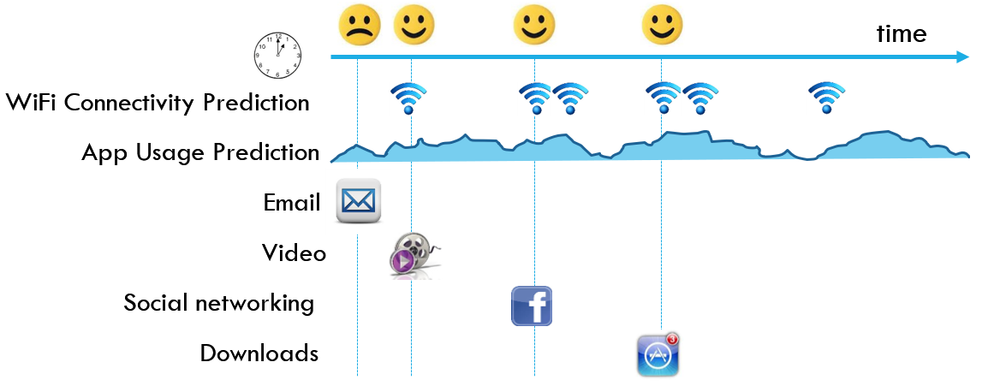
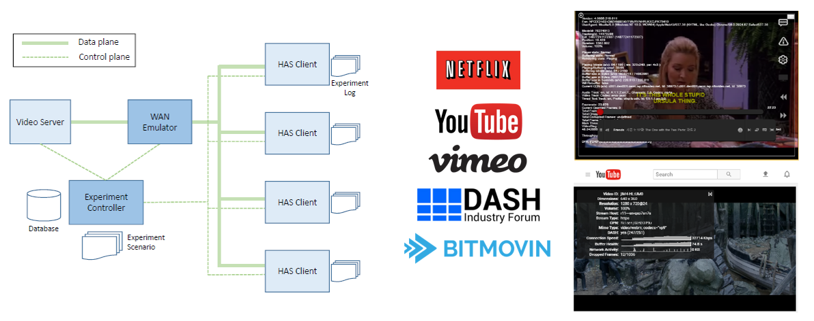
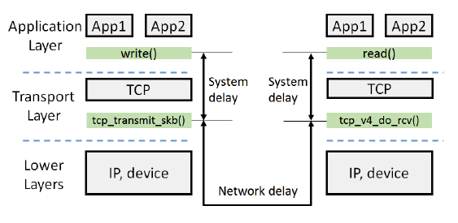
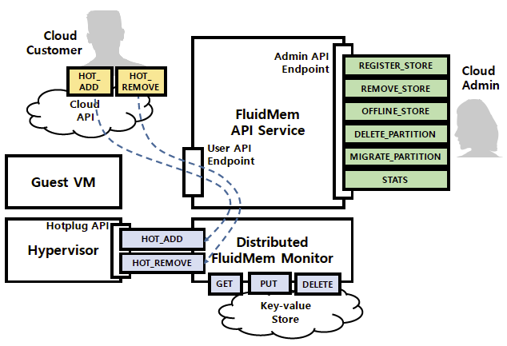

### Research Areas
* Mobile data offloading
* Next-generation Internet
* Adaptive video streaming
* TCP latency measurement and solution 
* Data center resource disaggregation

### Mobile data offloading
 
* Wireless Internet service providers (ISPs) are increasingly changing their pricing plans and deploying Wi-Fi hotspots to offload their mobile traffic. However, these ISP-centric approaches for traffic management do not always match the interests of mobile users. Users face a complex, multi-dimensional tradeoff between cost, throughput, and delay in making their offloading decisions. To navigate this tradeoff, we develop Adaptive bandwidth Management through USer-Empowerment (AMUSE), a functional prototype of a practical, cost-aware Wi-Fi offloading system that takes into account a user's throughput-delay tradeoffs and cellular budget constraint. 

### Adaptive video streaming
 
* Existing HAS (HTTP adaptive streaming) techniques often suffer from problems like unstable video quality and suboptimal resource utilization. However, our fog computing approach can exploit existing telecommunication APIs, which expose network capabilities to applications, in order to coordinate between clients and the network. Our coordinated HAS solution, FLARE, optimizes the total utility of all clients in a cell while maintaining stable video quality and supporting user- and device-specific needs. We implement FLARE on a commodity LTE femtocell and use the implementation to conduct the first comparison of HAS players on an LTE femtocell. 
 
* The HTTP-based Adaptive Streaming (HAS) techniques are widely used in Internet video streaming services including YouTube and Netflix. In this research, we investigate the detailed operations of the different players by code level analysis and through reverse engineering. Specifically, we present the pseudo codes of 3 open source players, and devise a method to obtain the detailed operation information of popular streaming players. We conduct extensive experiments on our testbed, and provide suggestions based on the behaviors of these players.

%### TCP latency measurement and solution
% 
%Today’s end devices and Internet infrastructure cannot provide reliably low latencies, e.g., due to the “bufferbloat” problem.
%Indeed, current latency diagnosis tools cannot even decompose end-to-end delay measurements into delays on network links and delays %within the device protocol stack. We develop a latency diagnosis tool that provides this decomposition without requiring admin
%privileges at the sender or receiver. We implement and deploy the tool in lab testbed, WAN, and Internet environments, and validated it %achieves more than 98% accuracy compared to the ground-truth in different production networks. 

### Data center resource disaggregation
 
Disaggregating resources in data centers is an emerging trend. Recent work has begun to explore memory disaggregation, but suffers limitations including lack of consideration of the complexity of cloud-based deployment, including heterogeneous hardware and APIs for cloud users and operators. In this research, we develop FluidMem, a complete system to realize disaggregated memory in the datacenter. Going beyond simply demonstrating remote memory is possible, we create an entire Memory as a Service. We define the requirements of Memory as a Service and build its implementation in Linux as FluidMem. 
